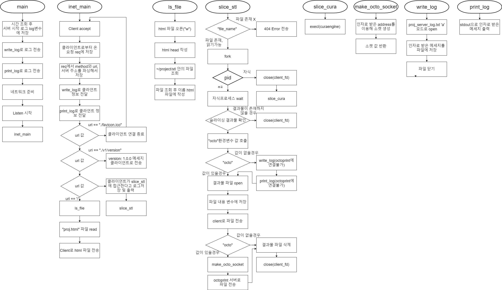
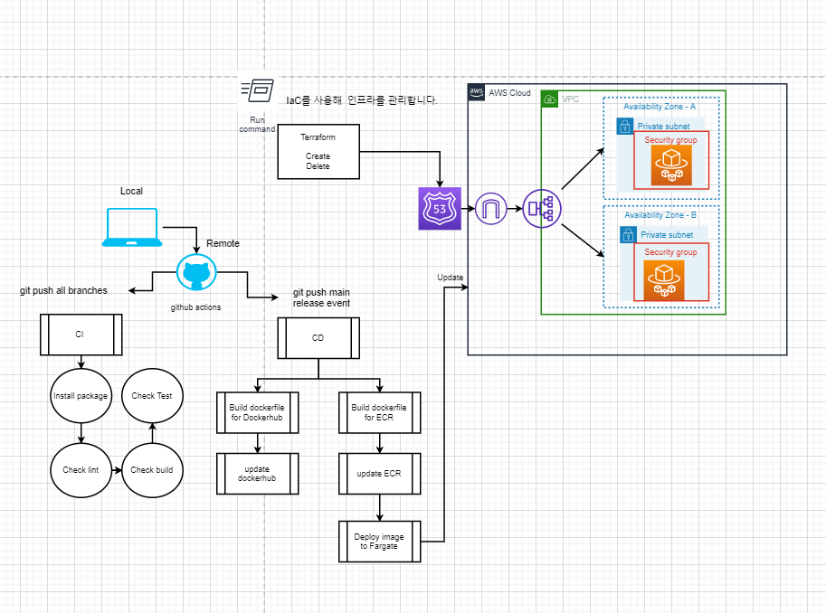

## 2020 - 1 클라우드 컴퓨팅 텀 프로젝트

### 프로젝트 명: IAC
(Infrastructure as Code based AWS Cloud Management & CI/CD Devcelopment)

### 프로젝트 멤버:
1. 김기혁: CI/CD 파이프라인 및 Terraform 개발
2. 이준상: Docker 컨테이너 개발 및 서비스 개발

### 프로젝트 소개 및 개발내용 소개
* 프로젝트 소개: 슬라이싱 웹 서버 개발 및 컨테이너 기반 배포/운영 환경 구축
* 개발 내용 소개: CuraEngine을 사용하여 소켓프로그래밍을 통해 웹 클라이언트와 서버 간 통신을 하는 C언어 기반 3D 모델링 슬라이싱 서버 및 이를 개발/운영하기 위한 IaC, CI/CD 파이프라인을 개발하기 위해 Terraform, Docker, Github Actions, AWS 사용
* 기술스펙: C(HTTP 기반 소켓 서버), Dockerfile, Terraform, Github Actions

### 개발 결과물 소개

### 개발 결과물을 사용하는 방법 소개
1. Terraform Workspace 설정
2. Terraform apply로 배포
3. CI/CD 서버 동작 및 자동배포
4. 도메인(keykim.me)에 접속
5. 슬라이싱 서버 사용 가능

### 개발 결과물의 필요성 및 활용방안
* CI/CD 파이프라인을 통해 개발, 테스트, 배포를 효율적으로 수행할 수 있으며, Terraform을 통해  인프라의 상태를 쉽게 관리할 수 있다.
* 사용자의 컴퓨터에서 직접 슬라이싱을 할 경우에는 컴퓨터의 리소스를 잡아먹기 때문에, 클라우드에 서버를 올려 클라우드에서 작업을 대신 처리하도록 한다.
* 일반적으로 3D 프린터에 작업물을 전송하기 위해선 sd카드에 작업물을 담아 프린터로 전송하거나 usb를 이용해서 프린터를 전송해야 한다. 하지만, octoprint 프로그램을 라즈베리파이에 탑재해 프린터 보드와 usb로 연결해서 운영하면 결과물을 네트워크로 octoprint 서버로 전송하면, octoprint 서버에서 프린터 보드로 작업물을 전송해서 사용자의 수고를 덜어준다.